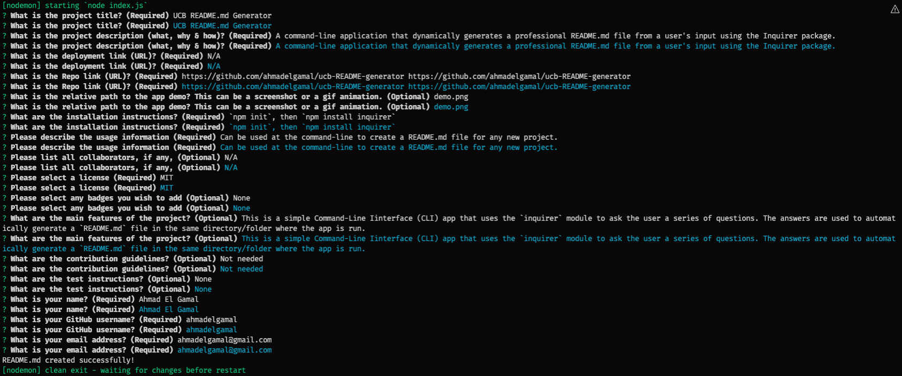

  # UCB README.md Generator
  
  ## Description
  A command-line application that dynamically generates a professional README.md file from a user's input using the Inquirer package.
  
  ## Deployment URL
  N/A
  
  ## Repo URL
  https://github.com/ahmadelgamal/ucb-README-generator https://github.com/ahmadelgamal/ucb-README-generator 

  ## Demo
  

  ## Installation
  `npm init`, then `npm install inquirer`
  
  ## Usage
  Can be used at the command-line to create a README.md file for any new project.
  
  ## Credits
  ### Collaborators
  N/A
    
  ## License
  MIT
  
  ## Badges
  None
  
  ## Features
  This is a simple Command-Line Iinterface (CLI) app that uses the `inquirer` module to ask the user a series of questions. The answers are used to automatically generate a `README.md` file in the same directory/folder where the app is run.
  
  ## Contributing
  Not needed
  
  ## Tests
  None
  
  ## Questions
  Please send your questions and comments to:
  - Ahmad El Gamal
  - GitHub Username: ahmadelgamal
  - Email: ahmadelgamal@gmail.com

